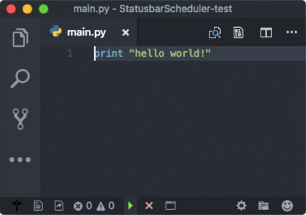
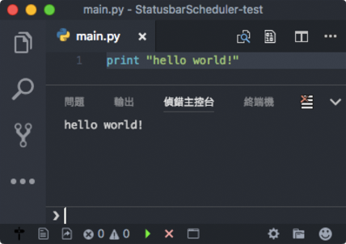

# Statusbar Scheduler

Trigger the execution of set of predefined commands by clicking statusbar button.

## Screenshot





## Usage

* configure setting `statusbar_scheduler.schedules` and `statusbar_scheduler.macros`

## Settings

* `statusbar_scheduler.schedules`
	* array of schedules
    * these properties are allowed for every item in the array
		* `text`: The text to show for the entry. You can embed icons in the text by leveraging the syntax: \"$(icon name)\". Where the icon-name is taken from the octicon icon set.
        * `triggerCommand`: The command for triggering execution. Can be used for keybinding.
		* `tooltip`: The tooltip text when you hover over this entry.
        * `color`: The foreground color for this entry.
        * `alignment`: The alignment of this item (left, right).
        * `priority`: The priority of this item. Higher value means the item should be shown more to the left.
        * `include`: If RegEx is valid, then the StatusbarItem is shown.
        * `exclude`: If RegEx is invalid, then the StatusbarItem is shown.
        * `schedule`
			* array of command or action objects
    		* the object should contains "command", "action" or "macro" property
				* `command` / `action` / `macro`: The identifier of a command/action/macro.
				* `args`: (optional) Arguments array for action.
        
    * example
```
[{
	"triggerCommand": "extension.scheduler.startDebugAndOpenPanel",
	"text": "$(triangle-right)",
	"tooltip": "Debug Start",
	"color": "#40ff40",
	"schedule": [
		{ "command": "workbench.action.focusActiveEditorGroup"},
		{ "macro": "startDebug"},
		{ "action": "delay", "args": ["200"] },
		{ "macro": "openPanel"}
	]
}, {
	"triggerCommand": "extension.scheduler.stopDebugAndClosePanel",
	"text": "$(x)",
	"tooltip": "Debug Stop",
	"color": "#ffa0a0",
	"schedule": [
		{ "command": "workbench.action.focusActiveEditorGroup"},
		{ "command": "workbench.action.debug.stop"},
		{ "command": "workbench.action.closePanel"}
	]

}]
```

* `statusbar_scheduler.macros`
	* array of macro
    * these properties are allowed for every item in the array
		* `name`: The identifier of the macro
        * `macro`
			* array of command or action objects
    		* the object should either contains "command" or "action" property
				* `command` / `action`: The identifier of a command/action.
				* `args`: (optional) Arguments array for action.
        
    * example
```
[{
	"name": "startDebug",
	"macro": [
		{ "command": "workbench.action.debug.restart"},
		{ "command": "workbench.action.debug.start"}
	]
}, {
	"name": "openPanel",
	"macro": [
		{ "command": "workbench.action.closePanel"},
		{ "command": "workbench.action.togglePanel"}
	]
}]	
```

## Changelog

* v1.0.0
    * initial release

